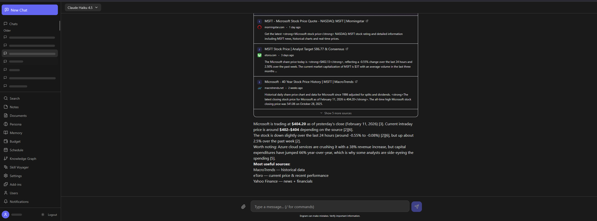
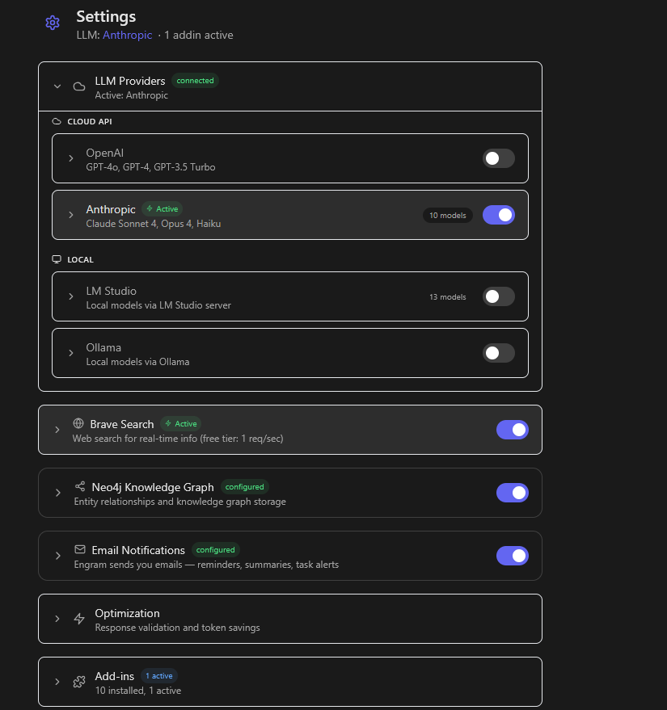
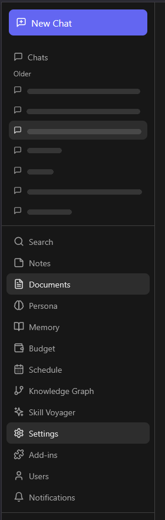

<div align="center">

# Engram

### Your Personal AI Assistant With Memory

**Local-first AI chat that remembers everything, builds knowledge graphs, learns skills autonomously, searches the web, and keeps all your data on your machine.**

[](LICENSE)
[](https://docs.docker.com/get-docker/)
[](https://windsurf.com/refer?referral_code=y0tubroc6i3rvqvu)

---

[**Install**](#install) | [**What Gets Installed**](#what-gets-installed) | [**Features**](#features) | [**Screenshots**](#screenshots) | [**Architecture**](#architecture) | [**Configuration**](#configuration)

</div>

---

## Screenshots

<div align="center">

**Chat with Web Search**



**Settings**



**Sidebar Navigation**



</div>

---

## Install

**Requires Docker only.** One command to start.

### Quick Start

```bash
git clone https://github.com/engramsoftware/engram.git
cd engram
docker compose up
```

Open **http://localhost:8000** in your browser. That is it.

The first build takes a few minutes (downloads Python packages and builds the frontend). After that, starts in seconds.

### Stop and Start

```bash
docker compose down      # stop
docker compose up -d     # start in background
docker compose logs -f   # view logs
```

### Uninstall

```bash
docker compose down -v   # remove the container and the model cache volume
sudo rm -rf ./data       # delete all data: users, chats, settings, secrets (owned by the container's user on Linux)
```

Skip the `rm` to keep your data: it lives in the `./data` folder next to `docker-compose.yml`.

### Troubleshooting

**Windows:** Engram works on Windows. If you see `exec /app/docker-entrypoint.sh: no such file or directory`, ensure you have the latest code (`git pull`). The repo includes a fix for Windows line endings; the Dockerfile normalizes scripts during build.

---

## What Gets Installed

When you run `docker compose up`, Docker builds the image in two stages and downloads everything Engram needs. Here is exactly what happens and why.

### Stage 1: Frontend Build (Node.js)

Docker pulls **Node.js 20** and builds the React frontend into static HTML/CSS/JS files.

| Component | What It Is | Why Engram Needs It |
|-----------|-----------|-------------------|
| **React 18** | UI framework | Renders the entire chat interface — conversations, sidebar, settings, notes, budget |
| **TypeScript** | Typed JavaScript | Catches bugs at compile time instead of runtime, keeps the frontend maintainable |
| **Tailwind CSS** | Utility-first CSS framework | Styles every component without writing custom CSS files — dark theme, responsive layout |
| **Vite** | Build tool and dev server | Bundles and optimizes the frontend for production (fast builds, tree-shaking, minification) |
| **Zustand** | State management | Manages app state (active conversation, messages, settings) without prop-drilling |
| **React Router** | Client-side routing | Handles navigation between chat, settings, and other pages without full page reloads |
| **react-markdown + remark-gfm** | Markdown renderer | Renders LLM responses as formatted text with tables, code blocks, bold, links, lists |
| **react-syntax-highlighter** | Code highlighting | Syntax-colors code blocks in LLM responses (Python, JavaScript, SQL, etc.) |
| **Lucide React** | Icon library | Provides all icons in the UI (send button, settings gear, sidebar icons, etc.) |
| **date-fns** | Date formatting | Displays message timestamps, schedule dates, and relative time ("2 hours ago") |

After building, the compiled frontend (~2 MB) is copied into the backend container to be served as static files. No separate frontend server needed.

### Stage 2: Backend (Python 3.11)

Docker pulls **Python 3.11 slim** and installs the backend with all its dependencies.

#### Core Server

| Package | What It Is | Why Engram Needs It |
|---------|-----------|-------------------|
| **FastAPI** | Async web framework | Handles all API routes — messages, auth, settings, budget, notes, documents, schedule |
| **uvicorn** | ASGI server | Runs FastAPI in production with async I/O support and Server-Sent Events for streaming |
| **python-multipart** | Form data parser | Handles file uploads (RAG documents, profile images) |
| **pydantic** | Data validation | Validates every API request and response with type-safe models |
| **python-dotenv** | Environment variables | Loads configuration from `.env` files |

#### Database and Storage

| Package | What It Is | Why Engram Needs It |
|---------|-----------|-------------------|
| **aiosqlite** | Async SQLite driver | Main database for users, conversations, messages, settings, budget, schedule — zero-install, no separate server |
| **ChromaDB** | Vector database | Stores and searches embeddings for memories, messages, documents, and negative knowledge — enables semantic "meaning-based" search instead of just keyword matching |
| **neo4j** (driver) | Graph database client | Connects to Neo4j Aura (optional) for the knowledge graph — stores entities and relationships extracted from conversations |

#### Search and Retrieval

| Package | What It Is | Why Engram Needs It |
|---------|-----------|-------------------|
| **rank-bm25** | BM25 ranking algorithm | Keyword-based search scoring — combined with vector search for hybrid retrieval (catches exact terms vectors might miss) |
| **sentence-transformers** | ML model framework | Runs the cross-encoder re-ranker that scores how well a retrieved result actually answers the query (second-pass quality filter) |
| **beautifulsoup4 + markdownify** | HTML parser and converter | Fetches and cleans web pages into readable text for the LLM to reference in responses |
| **diskcache** | Persistent cache | Caches fetched web page content to avoid re-downloading the same URL repeatedly |

#### AI and NLP

| Package | What It Is | Why Engram Needs It |
|---------|-----------|-------------------|
| **GLiNER** | Named entity recognition | Extracts entities (people, places, organizations) from your queries at search time to find matching nodes in the knowledge graph |
| **httpx** | Async HTTP client | Communicates with LLM providers (OpenAI, Anthropic, LM Studio, Ollama) — handles streaming responses, retries, and timeouts |

#### Security and Auth

| Package | What It Is | Why Engram Needs It |
|---------|-----------|-------------------|
| **PyJWT + python-jose** | JSON Web Tokens | Authenticates API requests — every message and settings change requires a valid JWT token |
| **bcrypt** | Password hashing | Hashes user passwords so they are never stored in plain text |
| **cryptography** | Encryption library | Encrypts API keys at rest in the database using Fernet (AES-128-CBC) — your OpenAI/Anthropic keys are never stored as plain text |

#### Document Processing

| Package | What It Is | Why Engram Needs It |
|---------|-----------|-------------------|
| **pypdf** | PDF parser | Extracts text from uploaded PDF files for RAG (ask questions about your documents) |
| **python-docx** | Word document parser | Extracts text from uploaded .docx files for RAG |
| **python-dateutil** | Flexible date parser | Parses dates from LLM output in any format — "tomorrow at 3pm", "in 2 hours", "2026-02-15 14:00" — used for scheduled emails and calendar events |

#### MCP Server

| Package | What It Is | Why Engram Needs It |
|---------|-----------|-------------------|
| **mcp** | Model Context Protocol SDK | Runs the MCP server (44 tools) for Cursor, Windsurf and other MCP-compatible editors — gives your code editor Engram's MCP knowledge base (skills, solutions, playbooks, sessions) plus web fetch, time and read-only git tools |

### Pre-Downloaded ML Models

After installing packages, Docker pre-downloads two ML models so your first message is not slow:

| Model | Size | What It Does |
|-------|------|-------------|
| **all-MiniLM-L6-v2** (ONNX) | ~23 MB | ChromaDB's default embedding model — converts text into 384-dimensional vectors for semantic search across memories, messages, and documents |
| **ms-marco-MiniLM-L-6-v2** (cross-encoder) | ~23 MB | Re-ranks search results by scoring query-passage relevance — makes retrieval more accurate by filtering out false positives from the initial vector search |

Both models run locally inside the container. No API calls, no cost, no data leaves your machine.

### First-Run Setup

On the very first startup, the entrypoint script:

1. **Generates a secure JWT secret** (64-character random hex) so your auth tokens cannot be forged
2. **Generates a secure encryption key** (32-character random hex) for encrypting API keys at rest
3. **Creates all data directories** under `/data` for SQLite, ChromaDB, uploads, skills, and logs
4. **Starts the FastAPI server** on port 8000, serving both the API and the compiled React frontend

After the first run, subsequent starts skip key generation and boot in seconds.

---

## Features

### Multi-Provider LLM Support

Connect to any LLM provider and switch models mid-conversation. Configure providers in the Settings tab.

| Provider | Cost | Setup |
|----------|------|-------|
| **OpenAI** (GPT-4o, o1, etc.) | Per-token | API key from [platform.openai.com](https://platform.openai.com) |
| **Anthropic** (Claude 3.5 Sonnet, Haiku, etc.) | Per-token | API key from [console.anthropic.com](https://console.anthropic.com) |
| **LM Studio** | Free, runs locally | Download from [lmstudio.ai](https://lmstudio.ai), start server |
| **Ollama** | Free, runs locally | Download from [ollama.com](https://ollama.com), run `ollama serve` |
| **Custom (OpenAI-compatible)** | Depends on the server | Any server that speaks the OpenAI API: llama.cpp (`llama-server`), vLLM, Groq, Together, OpenRouter. Settings → Models → Custom, enter the server URL (and a key if it needs one) |

Running Llama? Use Ollama (`ollama pull llama3.1`), LM Studio, or `llama-server` through the Custom provider.

### Autonomous Memory

Engram learns from every conversation automatically. You do not need to save anything manually.

- **Extracts** facts, preferences, decisions, skills, goals, and relationships from your messages
- **Resolves conflicts** when new information contradicts something it already knows
- **Injects relevant memories** into future conversations so the AI has context about you
- **Tracks negative knowledge** so it remembers what failed or what to avoid


### Knowledge Graph

Builds a Neo4j knowledge graph from your conversations over time.

- LLM-based entity and relationship extraction (people, places, technologies, preferences)
- Dynamic relationship labels generated by the LLM (LIVES_IN, PREFERS, WORKS_AT, etc.)
- 2-hop graph traversal at query time for deep contextual retrieval
- Temporal decay so recent knowledge is weighted higher than old information
- Community detection groups related entities by topic
- Old relationships are marked inactive rather than deleted, preserving history

### Web Search

Searches the web via the Brave Search API when you ask.

- **Brave Search** (2000 free queries/month)
- Adaptive gate decides IF a query needs web search (no LLM call, pure heuristics)
- LLM-powered query reformulation that understands conversation context ("search it" becomes a real query)
- Returns numbered search results with titles, URLs, and descriptions

### RAG Documents

Upload PDFs, DOCX, TXT, or Markdown files. Engram chunks them, generates embeddings, and retrieves relevant sections when you ask questions about them.

### Notes

Create notes manually through the sidebar, or let the AI auto-save important information from conversations. Notes are searchable and injected as context when relevant.

### Personas

Custom AI personalities with configurable system prompts. Switch between different personas (assistant, tutor, coder, researcher) depending on what you need.

### Skill Voyager (Autonomous Learning)

Voyager-inspired skill learning system that improves over time.

- **Classifies** every query (factual, research, creative, technical, conversational) and matches it to learned skills
- **Applies** skill strategies by injecting them into the LLM's context before generation
- **Evaluates** response quality and updates skill confidence with asymmetric EMA
- **Self-reflects** on failures and evolves skill strategies in-place
- **Learns from corrections** — edits, regenerations, and thumbs-down reduce skill confidence
- **Retrieval learning** — tracks which retrieval sources (memory, graph, web, hybrid) work best per query type
- **Curriculum engine** proposes new skills to fill knowledge gaps
- Works across both chat and OpenAI-compatible API (code agents train skills too)
- Skill lifecycle: candidate → verified → mastered → deprecated
- Toggle on/off per user in Settings → Addins. **Fully optional — nothing breaks if disabled.**

### Plugin System

Extensible plugin architecture with built-in plugins:

- **Skill Voyager** - autonomous skill learning (interceptor + GUI dashboard)
- **Code Improver** - code analysis and adaptive retrieval
- **Calculator** - safe math evaluation using AST parsing (no eval)
- **Image Generator** - image generation support
- **Auto Translator** - automatic message translation
- **Mood Journal** - track emotional patterns over time
- **Pomodoro** - focus timer with session tracking
- **Dice Roller** - random number generation for tabletop games
- **Word Counter** - text statistics and word count
- **Web Search** - search integration plugin

### Security and Privacy

- **Most data stays on your machine.** SQLite and ChromaDB store everything locally. The exception is the **optional** Neo4j Aura knowledge graph, which is a cloud service — if you enable it, entity and relationship data is stored on Neo4j's servers.
- **Private network only.** Blocks all public IP access by default (LAN and VPN only).
- **Accounts and admins.** The first account you create is the admin. There is no open sign-up: admins add people in Settings › Users. Only admins manage accounts. Changing a password signs out that account's other sessions, and Settings › Account has "Sign out everywhere".
- **Forgotten password.** An admin sets a new one in Settings › Users. If you're the only admin, run `docker exec -it engram python reset_password.py you@example.com` (add `--make-admin` to restore admin rights).
- **API keys encrypted at rest** using Fernet symmetric encryption (AES-128-CBC).
- **Rate limiting** on authentication endpoints to prevent brute force attacks.
- **Security headers** on all responses: X-Frame-Options, nosniff, Referrer-Policy and a baseline CSP (no plugins, no framing, no form posts elsewhere).
- **Isolated previews and uploads.** HTML/SVG previews of model output run in a sandboxed iframe with its own origin, so they can't read your login. Uploaded files other than images and PDFs download instead of opening, and are served with a CSP sandbox.
- **Input validation** on all user-facing endpoints.

---

## Architecture

Every message flows through a retrieval-augmented pipeline:

```
User Message
  |
  +-- [INLET] Parallel context retrieval:
  |     +-- Hybrid search (BM25 + vector via ChromaDB)
  |     +-- Autonomous memories (vector similarity, min confidence 0.3)
  |     +-- Notes (text search, top 3 relevant)
  |     +-- RAG documents (vector search, top 3 chunks)
  |     +-- Knowledge graph (Neo4j entity linking, 2-hop traversal)
  |     +-- Web search (Brave API, if triggered)
  |
  +-- [RRF FUSION] Reciprocal Rank Fusion merges and ranks all sources
  |
  +-- [INTERCEPTORS] Addin hooks (e.g. Skill Voyager classifies query, injects skill strategy)
  |
  +-- [LLM] Stream response via Server-Sent Events
  |
  +-- [INTERCEPTORS] Post-LLM hooks (evaluate response, update skill confidence)
  |
  +-- [OUTLET] Background processing after response:
        +-- Memory extraction and conflict resolution
        +-- Entity and relationship extraction to knowledge graph
        +-- Note and email marker extraction
        +-- Retrieval learning (which sources helped most)
```

Context is injected into the system prompt with a 6000-token budget. Priority order: warnings, memories, graph context, conversation history, web results.

### Tech Stack

| Layer | Technology |
|-------|-----------|
| **Backend** | Python 3.11, FastAPI, uvicorn |
| **Frontend** | React 18, TypeScript, Tailwind CSS, Zustand |
| **Database** | SQLite via aiosqlite (zero-install, async) |
| **Vector Store** | ChromaDB (embedded, file-based) |
| **Knowledge Graph** | Neo4j Aura (optional, free tier available) |
| **Search** | Brave Search API |
| **Entity Extraction** | GLiNER + spaCy for query-time, LLM-based for outlet |
| **Auth** | JWT with bcrypt password hashing |
| **MCP Server** | 44 tools across 3 SQLite databases (see [MCP server](#mcp-server-for-editors)) |

### MCP Server for Editors

Point your editor at `mcp_config.example.json` (Cursor: `.cursor/mcp.json`). It runs `docker exec -i -u engram engram python mcp_server.py`, so the server uses the container's unprivileged user.

| Setting | Default | What it does |
|---------|---------|--------------|
| `ENGRAM_MCP_DISABLED_TOOLS` | (none) | Comma-separated tools to switch off, e.g. `fetch_url,git_diff` |
| `ENGRAM_MCP_FETCH_ALLOW_PRIVATE` | off | `fetch_url` only reaches public addresses (every redirect is re-checked), so it can't read the Engram API, your LAN or cloud metadata. Set `1` to allow private ones. |
| `ENGRAM_MCP_GIT_ROOTS` | working directory | Folders the read-only `git_*` tools may look into (`:`-separated; `;` on Windows). Repo config that could run commands (fsmonitor, external diff) is ignored. |
| `MCP_AUDIT_LOG` | off | `1` writes tool name, outcome and duration (never arguments) to `data/mcp/audit.log` |

The `git_*` tools need git and your repositories, which the Docker image doesn't have; they work when `mcp_server.py` runs on the host. Tool failures come back to the editor as errors.

### Two API Entry Points

1. **`POST /messages`** - Main chat UI endpoint with streaming
2. **`POST /api/v1/chat/completions`** - OpenAI-compatible API for code agents and external tools. It needs a personal API token: create one in Settings › Account › API tokens and use it as the agent's API key (`Authorization: Bearer engram_...`). Requests run as that account.

Both run the same retrieval and outlet pipeline.

---

## Configuration

On first start, Engram auto-generates secure JWT and encryption keys. No manual setup needed.

In Docker they are saved in `data/secrets.env` (see [Data and Privacy](#data-and-privacy)), so rebuilding or updating the container keeps everyone signed in and saved API keys readable. Updating from an image that kept them inside the container? Save them first; the command is under Data and Privacy. Without Docker, if `JWT_SECRET_KEY` isn't set, Engram generates one and keeps it in `data/.jwt_secret`.

The container runs Engram as an unprivileged user (uid 10001). If your `data` folder is on a mount that ignores file ownership (some Windows/macOS setups), it falls back to root and logs a warning; a Docker volume avoids that. Run other commands in the container as the same user (`docker exec -u engram …`, as in `mcp_config.example.json`) so files they create stay writable by Engram; `reset_password.py` does this by itself.

LLM provider API keys are configured through the **Settings** tab in the app. They are stored encrypted in the database, not in plain text.

### Environment Variables

You can set environment variables in `docker-compose.yml` or mount a `.env` file read-only (`./backend/.env:/app/.env:ro`). See `backend/.env.example` for all options.

**Behind a reverse proxy?** Set `TRUSTED_PROXIES` to the proxy's IP (or CIDR) so Engram uses the client address from `X-Forwarded-For`. Without it the header is ignored, so nobody can fake a LAN address. On Docker Desktop (Windows/macOS), every connection can appear to come from Docker's own network, so the LAN-only check can't tell local and remote visitors apart there. Don't expose the port to the internet.

### Local LLM Providers (LM Studio, Ollama, llama.cpp)

If you run LM Studio, Ollama or `llama-server` on your host machine, use `host.docker.internal` as the hostname so the Docker container can reach them:

```yaml
environment:
  - LMSTUDIO_BASE_URL=http://host.docker.internal:1234/v1
  - OLLAMA_BASE_URL=http://host.docker.internal:11434
  - CUSTOM_BASE_URL=http://host.docker.internal:8080/v1   # llama.cpp, vLLM, ...
```

A bare address (`http://host:1234`) gets `/v1` added where the API needs it. These are only fallbacks; whatever you save in Settings → Models wins.

Adding a provider in code: add a spec to `backend/llm/registry.py`, a class in `backend/llm/`, map it in `backend/llm/factory.py`, and add its row to `frontend/src/utils/providers.ts` (`backend/tests/test_llm_registry.py` fails if they disagree).

### Optional Services

These are not required but add extra capabilities:

| Service | What It Adds | How to Set Up |
|---------|-------------|---------------|
| **Neo4j Aura** | Knowledge graph with entity relationships | Free tier at [neo4j.com/cloud](https://neo4j.com/cloud/aura-free/). Add URI and password in Settings. |
| **Brave Search** | Primary web search provider (2000 free queries/month) | Free API key at [brave.com](https://api-dashboard.search.brave.com/app/keys). Add in Settings. |
| **LM Studio** | Run LLMs locally for free (no API key needed) | Download from [lmstudio.ai](https://lmstudio.ai). Start the local server on port 1234. |
| **Ollama** | Run LLMs locally for free (no API key needed) | Download from [ollama.com](https://ollama.com). Run `ollama serve` in a terminal. |

Without any optional services, Engram still works with any LLM provider you configure. Add a Brave API key for web search.

---

## Data and Privacy

**Most data stays on your machine.** The following data is sent externally:

- **LLM API calls** to whichever provider you configure (OpenAI, Anthropic, or local). Your messages and conversation context are sent to generate responses.
- **Web search queries** when you explicitly ask via the Brave Search API.
- **Knowledge graph data** if you enable Neo4j Aura (optional cloud service) — entities and relationships extracted from your conversations are stored on Neo4j's servers.

If you use only local LLM providers (LM Studio, Ollama) and skip Neo4j, **nothing leaves your machine** except web search queries.

All user data lives in the `./data` folder, mounted at `/data` inside the container:

```
/data/
+-- app.db              # SQLite database (users, conversations, messages, settings)
+-- secrets.env         # Generated login and API-key encryption secrets (keep it with app.db)
+-- chroma/             # Vector embeddings (memories, messages, documents)
+-- mcp/                # MCP server databases (knowledge, interactions, reasoning)
+-- learning/           # Skill transfer and adaptive retrieval data
+-- uploads/            # Files you upload for RAG
+-- crawl_cache/        # Search validation cache
+-- logs/               # Service logs
```

**To reset everything:** `docker compose down`, then delete the `./data` folder (`sudo rm -rf ./data` on Linux).

**Secrets:** on first start Engram generates a login secret and the key that encrypts your saved API keys, and keeps them in `data/secrets.env`, so they survive rebuilds. Back it up with `app.db`: without it, saved API keys can't be decrypted. Setting `JWT_SECRET_KEY` / `ENCRYPTION_KEY` in the environment overrides it.

**Upgrading from a version that kept secrets inside the container** (before `data/secrets.env` existed): those secrets exist only in the current container, so save them while it still exists: before `docker compose down`, `up --build` or any other step that replaces it (`docker start engram` first if it is stopped). Otherwise everyone is logged out and saved API keys must be re-entered.

```bash
docker exec engram sh -c "umask 077; grep -E '^(JWT_SECRET_KEY|ENCRYPTION_KEY)=' /app/.env | grep -v '=change-me' > /data/secrets.env"
```

If you set `JWT_SECRET_KEY` / `ENCRYPTION_KEY` as environment variables, nothing changes: keep them set. If you ran a pre-release build that kept them in `data/.engram.env`, there's nothing to do either: Engram reads them (and the other settings in that file) on start and saves the secrets to `data/secrets.env`.

**To back up data:** `docker cp engram:/data ./backup`

---

## Disclaimer

**This software is provided "as is" without warranty of any kind.** By using Engram, you acknowledge and agree that:

- **You are solely responsible** for all content generated by AI models through this software. The authors have no control over LLM outputs and accept no liability for them.
- **You are solely responsible** for any third-party API costs incurred (OpenAI, Anthropic, Brave Search, Neo4j, etc.). Monitor your own API usage and billing.
- **You are solely responsible** for reviewing and verifying any AI-generated content before acting on it, sharing it, or publishing it.
- **You are solely responsible** for securing your own installation, backing up your data, and understanding what data is sent to external services.
- **The authors and contributors are not liable** for any data loss, security incidents, unauthorized access, or damages of any kind arising from the use of this software.
- **No medical, legal, or financial advice.** AI-generated content is not a substitute for professional advice. Do not rely on this software for decisions affecting health, legal matters, or finances.

By using this software, you agree to indemnify and hold harmless the authors and contributors from any claims, damages, or expenses arising from your use. See [LICENSE](LICENSE) for full legal terms.

---

## Built With

Engram was built entirely with [**Windsurf**](https://windsurf.com/refer?referral_code=y0tubroc6i3rvqvu), the AI-powered IDE by Codeium. From backend architecture to frontend components, every line of code was pair-programmed with Windsurf's Cascade agent.

---

## License

**Non-Commercial Use Only.** See [LICENSE](LICENSE) for full terms.

Free to use, modify, and share for personal and non-commercial purposes. Commercial use requires a separate license.

Copyright (c) 2025-2026 Engram Software.
